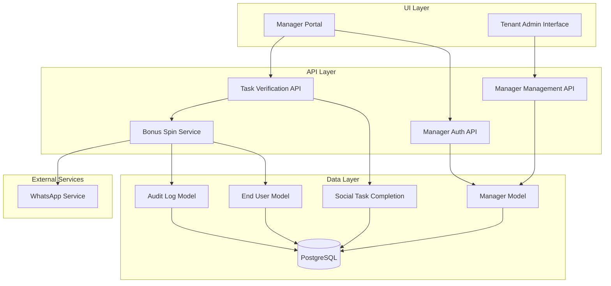
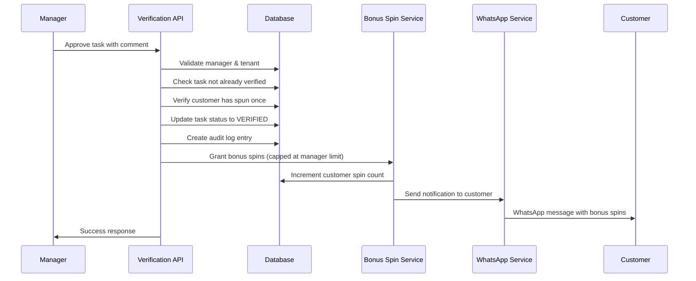

# Design Document: Manager Role Verification

## Overview

The Manager Role Verification feature introduces a new user role to the multi-tenant spin-the-wheel campaign platform. This role sits between Tenant Admin and Customer in the user hierarchy, with the primary responsibility of manually verifying social media task completions and granting bonus spins.

The design follows a three-tier architecture:
1. **Database Layer**: New Manager model with relationships to Tenant and audit logging
2. **API Layer**: RESTful endpoints for manager authentication, task verification, and admin management
3. **UI Layer**: Manager portal for task verification and Tenant Admin interface for manager management

Key design principles:
- Multi-tenant isolation enforced at every layer
- Minimal customer data exposure (privacy-first approach)
- Mandatory audit trail for accountability
- Role-based access control to prevent privilege escalation
- Idempotent operations to prevent duplicate spin grants

## Architecture

### System Components



### Data Flow: Task Verification



## Components and Interfaces

### Database Schema Changes

#### Manager Model

```typescript
model Manager {
  id                    String   @id @default(cuid())
  email                 String   @unique
  name                  String
  passwordHash          String
  tenantId              String
  tenant                Tenant   @relation(fields: [tenantId], references: [id])
  maxBonusSpinsPerApproval Int   @default(10)
  isActive              Boolean  @default(true)
  createdAt             DateTime @default(now())
  updatedAt             DateTime @updatedAt
  
  auditLogs             ManagerAuditLog[]
  
  @@index([tenantId])
  @@index([email])
}
```

#### ManagerAuditLog Model

```typescript
model ManagerAuditLog {
  id                    String   @id @default(cuid())
  managerId             String
  manager               Manager  @relation(fields: [managerId], references: [id])
  tenantId              String
  tenant                Tenant   @relation(fields: [tenantId], references: [id])
  action                String   // "APPROVE" | "REJECT"
  taskCompletionId      String
  taskCompletion        SocialTaskCompletion @relation(fields: [taskCompletionId], references: [id])
  comment               String   // Mandatory comment from manager
  bonusSpinsGranted     Int?     // Null for rejections
  createdAt             DateTime @default(now())
  
  @@index([managerId])
  @@index([tenantId])
  @@index([taskCompletionId])
  @@index([createdAt])
}
```

#### SocialTaskCompletion Model Updates

```typescript
// Add new fields to existing model
model SocialTaskCompletion {
  // ... existing fields ...
  
  verifiedBy            String?  // Manager ID who verified
  verifiedAt            DateTime?
  verificationComment   String?  // Manager's comment
  
  managerAuditLogs      ManagerAuditLog[]
}
```

### API Endpoints

#### Manager Authentication

**POST /api/manager/auth/login**
- Request: `{ email: string, password: string }`
- Response: `{ token: string, manager: { id, name, email, tenantId, maxBonusSpinsPerApproval } }`
- Validates credentials and returns JWT token with manager role and tenant ID

**POST /api/manager/auth/logout**
- Request: `{ token: string }`
- Response: `{ success: boolean }`
- Invalidates the session token

#### Task Verification

**GET /api/manager/tasks/pending**
- Query params: `{ status?: string, page?: number, limit?: number }`
- Response: `{ tasks: TaskCompletion[], total: number, page: number }`
- Returns pending task completions for manager's tenant
- Filters to only show customers who have spun at least once
- Returns minimal customer data (customer ID, last 4 digits of phone)

**GET /api/manager/tasks/:id**
- Response: `{ task: TaskCompletionDetail }`
- Returns detailed task information including:
  - Task type, target URL, submission timestamp
  - Minimal customer data (ID, phone last 4 digits)
  - Task requirements and configured bonus spins
  - Current status

**POST /api/manager/tasks/:id/approve**
- Request: `{ comment: string }`
- Response: `{ success: boolean, bonusSpinsGranted: number }`
- Validates comment is not empty
- Checks manager's max bonus spin limit
- Updates task status to VERIFIED
- Grants bonus spins (capped at manager's limit)
- Creates audit log entry
- Sends WhatsApp notification

**POST /api/manager/tasks/:id/reject**
- Request: `{ comment: string }`
- Response: `{ success: boolean }`
- Validates comment is not empty
- Updates task status to REJECTED
- Creates audit log entry
- Sends WhatsApp notification with rejection reason

#### Manager Management (Tenant Admin)

**GET /api/admin/managers**
- Response: `{ managers: Manager[] }`
- Returns all managers for the authenticated tenant admin's tenant
- Includes manager stats (total approvals, rejections)

**POST /api/admin/managers**
- Request: `{ email: string, name: string, password: string, maxBonusSpinsPerApproval: number }`
- Response: `{ manager: Manager }`
- Creates new manager account for tenant
- Validates email uniqueness
- Hashes password before storage

**PUT /api/admin/managers/:id**
- Request: `{ name?: string, maxBonusSpinsPerApproval?: number, isActive?: boolean }`
- Response: `{ manager: Manager }`
- Updates manager information
- Validates tenant ownership

**GET /api/admin/managers/:id/audit-logs**
- Query params: `{ startDate?: string, endDate?: string, action?: string }`
- Response: `{ logs: AuditLog[] }`
- Returns audit logs for specific manager
- Includes comments and actions taken

### Service Layer

#### ManagerVerificationService

```typescript
interface ManagerVerificationService {
  // Verify task completion and grant spins
  approveTask(
    managerId: string,
    taskCompletionId: string,
    comment: string
  ): Promise<{ success: boolean; bonusSpinsGranted: number }>;
  
  // Reject task completion
  rejectTask(
    managerId: string,
    taskCompletionId: string,
    comment: string
  ): Promise<{ success: boolean }>;
  
  // Get pending tasks for manager's tenant
  getPendingTasks(
    managerId: string,
    filters: TaskFilters
  ): Promise<TaskCompletion[]>;
  
  // Validate manager can verify task (tenant isolation)
  validateManagerAccess(
    managerId: string,
    taskCompletionId: string
  ): Promise<boolean>;
}
```

Implementation details:
- **approveTask**: 
  - Validates manager exists and is active
  - Checks task belongs to manager's tenant
  - Verifies task not already verified (idempotency)
  - Checks customer has spun at least once
  - Caps bonus spins at manager's maxBonusSpinsPerApproval
  - Creates audit log with comment
  - Calls BonusSpinService to grant spins
  - Sends WhatsApp notification

- **rejectTask**:
  - Similar validation as approveTask
  - Updates status to REJECTED
  - Creates audit log with rejection comment
  - Sends WhatsApp notification with reason

- **getPendingTasks**:
  - Filters by manager's tenantId
  - Joins with EndUser to check spin history
  - Only returns tasks where customer has spun at least once
  - Returns minimal customer data

#### BonusSpinService

```typescript
interface BonusSpinService {
  // Grant bonus spins to customer
  grantBonusSpins(
    customerId: string,
    amount: number,
    reason: string,
    grantedBy: string
  ): Promise<{ success: boolean; newSpinCount: number }>;
  
  // Send notification to customer
  notifyCustomer(
    customerId: string,
    message: string
  ): Promise<{ success: boolean }>;
}
```

Implementation details:
- **grantBonusSpins**:
  - Uses database transaction for atomicity
  - Increments EndUser.availableSpins
  - Logs the grant in audit trail
  - Returns new spin count

- **notifyCustomer**:
  - Retrieves customer phone number
  - Formats WhatsApp message
  - Calls WhatsApp service with retry logic (3 attempts, exponential backoff)
  - Logs notification status

## Data Models

### Manager

```typescript
interface Manager {
  id: string;
  email: string;
  name: string;
  passwordHash: string;
  tenantId: string;
  maxBonusSpinsPerApproval: number;
  isActive: boolean;
  createdAt: Date;
  updatedAt: Date;
}
```

### ManagerAuditLog

```typescript
interface ManagerAuditLog {
  id: string;
  managerId: string;
  tenantId: string;
  action: 'APPROVE' | 'REJECT';
  taskCompletionId: string;
  comment: string;
  bonusSpinsGranted: number | null;
  createdAt: Date;
}
```

### TaskCompletionDetail (API Response)

```typescript
interface TaskCompletionDetail {
  id: string;
  taskType: string;
  targetUrl: string;
  submittedAt: Date;
  status: 'PENDING' | 'VERIFIED' | 'REJECTED' | 'FAILED';
  customer: {
    id: string;
    phoneLast4: string; // Only last 4 digits
  };
  task: {
    bonusSpins: number;
    description: string;
  };
  verificationComment?: string;
  verifiedAt?: Date;
}
```

### ManagerStats (API Response)

```typescript
interface ManagerStats {
  id: string;
  name: string;
  email: string;
  maxBonusSpinsPerApproval: number;
  isActive: boolean;
  stats: {
    totalApprovals: number;
    totalRejections: number;
    totalBonusSpinsGranted: number;
  };
}
```


## Correctness Properties

A property is a characteristic or behavior that should hold true across all valid executions of a system—essentially, a formal statement about what the system should do. Properties serve as the bridge between human-readable specifications and machine-verifiable correctness guarantees.

### Property 1: Manager Creation with Tenant Association

*For any* tenant and valid manager data (email, name, password, maxBonusSpinsPerApproval), creating a manager account should result in a Manager record that is associated with the correct tenant and has all required fields persisted.

**Validates: Requirements 1.1, 1.2, 1.3**

### Property 2: Multi-Tenant Isolation for Task Visibility

*For any* manager and set of task completions across multiple tenants, querying pending tasks should return only tasks belonging to the manager's tenant and only from customers who have spun at least once.

**Validates: Requirements 3.1, 3.3, 3.4, 8.1**

### Property 3: Data Minimization for Customer Information

*For any* task completion viewed by a manager, the returned customer data should contain only customer ID and the last 4 digits of the phone number, with no additional personal information exposed.

**Validates: Requirements 3.2, 8.3**

### Property 4: Task Status Filtering

*For any* manager and status filter (PENDING, VERIFIED, REJECTED), querying tasks with that filter should return only tasks matching the specified status.

**Validates: Requirements 3.6**

### Property 5: Mandatory Comment Validation

*For any* approval or rejection attempt without a comment, the system should reject the operation and return a validation error.

**Validates: Requirements 4.2, 4.3**

### Property 6: Task Approval Status Update

*For any* pending task completion, when a manager approves it with a valid comment, the task status should be updated to VERIFIED.

**Validates: Requirements 4.4**

### Property 7: Task Rejection Status Update

*For any* pending task completion, when a manager rejects it with a valid comment, the task status should be updated to REJECTED.

**Validates: Requirements 4.5**

### Property 8: Bonus Spin Limit Enforcement

*For any* task approval where the configured bonus spins exceed the manager's maxBonusSpinsPerApproval, the granted spins should be capped at the manager's maximum limit.

**Validates: Requirements 4.6, 4.7**

### Property 9: Idempotent Task Verification

*For any* task completion that has already been verified, attempting to verify it again should be rejected and return an error without modifying the task or granting additional spins.

**Validates: Requirements 4.8**

### Property 10: Customer Eligibility Check

*For any* task approval, bonus spins should only be granted to customers who have spun the wheel at least once; customers without spin history should not receive bonus spins.

**Validates: Requirements 5.1**

### Property 11: Spin Count Increment

*For any* approved task completion for an eligible customer, the customer's available spin count should increase by the granted bonus spin amount (capped at manager's limit).

**Validates: Requirements 5.2, 5.3, 5.6**

### Property 12: Approval Notification Delivery

*For any* approved task completion, a WhatsApp notification should be sent to the customer containing the task type and number of bonus spins granted.

**Validates: Requirements 6.1, 6.3**

### Property 13: Rejection Notification Delivery

*For any* rejected task completion, a WhatsApp notification should be sent to the customer containing the rejection reason from the manager's comment.

**Validates: Requirements 6.2, 6.3**

### Property 14: Notification Retry Logic

*For any* failed notification delivery, the system should retry up to 3 times with exponential backoff before marking the notification as failed.

**Validates: Requirements 6.4**

### Property 15: Audit Log Creation

*For any* manager approval or rejection action, an audit log entry should be created containing manager ID, action type, task completion ID, timestamp, and the manager's comment.

**Validates: Requirements 7.1, 7.2**

### Property 16: Multi-Tenant Isolation for Audit Logs

*For any* tenant admin querying audit logs, only logs for managers and actions within their tenant should be returned.

**Validates: Requirements 7.3**

### Property 17: Audit Log Filtering

*For any* audit log query with filters (manager ID, date range, action type), only logs matching all specified filters should be returned.

**Validates: Requirements 7.4**

### Property 18: Audit Log Immutability

*For any* created audit log entry, attempts to update or delete the entry should be rejected and the log should remain unchanged.

**Validates: Requirements 7.5**

### Property 19: Cross-Tenant Access Prevention

*For any* manager attempting to access a task completion from a different tenant, the request should be rejected with an authorization error.

**Validates: Requirements 8.2**

### Property 20: Token Tenant Association

*For any* successful manager authentication, the returned session token should contain the manager's tenant ID.

**Validates: Requirements 8.4**

### Property 21: Dashboard Statistics Accuracy

*For any* manager's dashboard, the displayed counts for pending, verified, and rejected tasks should match the actual count of tasks in each status for that manager's tenant.

**Validates: Requirements 9.1**

### Property 22: Role-Based Access Control for Restricted Routes

*For any* manager attempting to access restricted routes (campaign creation, tenant settings, voucher management), the request should be denied with an authorization error.

**Validates: Requirements 10.1, 10.2, 10.3**

### Property 23: Manager Route Access

*For any* manager accessing allowed manager routes (dashboard, task verification), the request should be permitted without authorization errors.

**Validates: Requirements 10.4**

### Property 24: Tenant Admin Manager Listing

*For any* tenant admin querying their managers, only managers belonging to their tenant should be returned with complete information (name, email, status, max bonus spins, approval count).

**Validates: Requirements 11.1, 11.5**

### Property 25: Manager Deactivation Effect

*For any* manager account that is deactivated, subsequent login attempts should be rejected and existing sessions should be invalidated.

**Validates: Requirements 1.5, 11.6**

### Property 26: Manager Limit Update Propagation

*For any* manager whose maxBonusSpinsPerApproval is updated, all subsequent task approvals should enforce the new limit.

**Validates: Requirements 1.7, 11.4**

### Property 27: Manager Tenant Association Preservation

*For any* manager update operation (name, limit, status), the manager's tenant association should remain unchanged.

**Validates: Requirements 1.6**

### Property 28: Valid Credentials Authentication

*For any* manager with valid credentials (correct email and password), authentication should succeed and return a session token.

**Validates: Requirements 2.2**

### Property 29: Invalid Credentials Rejection

*For any* authentication attempt with invalid credentials (wrong email or password), the authentication should fail and return an error.

**Validates: Requirements 2.3**

### Property 30: Logout Token Invalidation

*For any* manager who logs out, their session token should be immediately invalidated and subsequent requests with that token should be rejected.

**Validates: Requirements 2.5**

### Property 31: Task Detail Information Completeness

*For any* task completion detail view, the response should include task type, target URL, submission timestamp, minimal customer data, task requirements, and configured bonus spins.

**Validates: Requirements 4.1**

### Property 32: Error Logging on Spin Allocation Failure

*For any* bonus spin allocation that fails, an error should be logged and the task completion should be marked for retry.

**Validates: Requirements 5.5**

### Property 33: Notification Delivery Logging

*For any* notification sent (success or failure), the delivery status should be logged for audit purposes.

**Validates: Requirements 6.5**

## Error Handling

### Authentication Errors

- **Invalid Credentials**: Return 401 Unauthorized with message "Invalid email or password"
- **Inactive Manager**: Return 403 Forbidden with message "Account has been deactivated"
- **Expired Token**: Return 401 Unauthorized with message "Session expired, please login again"
- **Invalid Token**: Return 401 Unauthorized with message "Invalid authentication token"

### Authorization Errors

- **Cross-Tenant Access**: Return 403 Forbidden with message "Access denied: resource belongs to different tenant"
- **Insufficient Permissions**: Return 403 Forbidden with message "Access denied: insufficient permissions"
- **Restricted Route Access**: Return 403 Forbidden with message "Managers cannot access this resource"

### Validation Errors

- **Missing Required Fields**: Return 400 Bad Request with message listing missing fields
- **Empty Comment**: Return 400 Bad Request with message "Comment is required for task verification"
- **Invalid Email Format**: Return 400 Bad Request with message "Invalid email format"
- **Duplicate Email**: Return 409 Conflict with message "Manager with this email already exists"

### Business Logic Errors

- **Already Verified Task**: Return 409 Conflict with message "Task has already been verified"
- **Customer Not Eligible**: Return 400 Bad Request with message "Customer must spin at least once before receiving bonus spins"
- **Task Not Found**: Return 404 Not Found with message "Task completion not found"
- **Manager Not Found**: Return 404 Not Found with message "Manager not found"

### External Service Errors

- **WhatsApp Service Failure**: Log error, retry up to 3 times, mark notification as failed if all retries fail
- **Database Connection Error**: Return 503 Service Unavailable with message "Service temporarily unavailable"
- **Transaction Failure**: Rollback all changes, return 500 Internal Server Error with message "Operation failed, please try again"

### Error Response Format

All API errors should follow this consistent format:

```typescript
interface ErrorResponse {
  error: {
    code: string;        // Machine-readable error code
    message: string;     // Human-readable error message
    details?: any;       // Optional additional error details
    timestamp: string;   // ISO 8601 timestamp
    requestId: string;   // Unique request identifier for tracking
  };
}
```

## Testing Strategy

### Dual Testing Approach

This feature requires both unit tests and property-based tests for comprehensive coverage:

- **Unit tests**: Verify specific examples, edge cases, and error conditions
- **Property tests**: Verify universal properties across all inputs

### Unit Testing Focus

Unit tests should focus on:
- Specific examples that demonstrate correct behavior (e.g., approving a task with valid data)
- Integration points between components (e.g., ManagerVerificationService calling BonusSpinService)
- Edge cases (e.g., empty comment, inactive manager, customer with no spins)
- Error conditions (e.g., database failures, WhatsApp service failures)

Avoid writing too many unit tests for scenarios that property-based tests can cover through randomization.

### Property-Based Testing

Property tests should be implemented using a property-based testing library appropriate for the chosen language (e.g., fast-check for TypeScript/JavaScript, Hypothesis for Python, QuickCheck for Haskell).

**Configuration**:
- Minimum 100 iterations per property test (due to randomization)
- Each property test must reference its design document property
- Tag format: **Feature: manager-role-verification, Property {number}: {property_text}**

**Example Property Test Structure** (TypeScript with fast-check):

```typescript
// Feature: manager-role-verification, Property 2: Multi-Tenant Isolation for Task Visibility
test('managers only see tasks from their tenant and eligible customers', async () => {
  await fc.assert(
    fc.asyncProperty(
      fc.array(taskCompletionArbitrary, { minLength: 5, maxLength: 20 }),
      fc.string(), // managerId
      fc.string(), // tenantId
      async (taskCompletions, managerId, tenantId) => {
        // Setup: Create manager and tasks
        const manager = await createManager({ id: managerId, tenantId });
        await createTaskCompletions(taskCompletions);
        
        // Execute: Query tasks as manager
        const visibleTasks = await managerService.getPendingTasks(managerId);
        
        // Verify: All returned tasks belong to manager's tenant
        // and customers have spun at least once
        expect(visibleTasks.every(task => 
          task.tenantId === tenantId && 
          task.customer.spinCount > 0
        )).toBe(true);
      }
    ),
    { numRuns: 100 }
  );
});
```

### Integration Testing

Integration tests should verify:
- End-to-end flows (login → view tasks → approve task → customer receives spins and notification)
- Database transactions and rollbacks
- Multi-tenant isolation across all layers
- Authentication and authorization middleware
- WhatsApp notification delivery with retry logic

### Test Data Generators

For property-based testing, implement generators for:
- **Manager**: Random email, name, tenantId, maxBonusSpinsPerApproval (1-50)
- **TaskCompletion**: Random status, tenantId, customerId, bonus spins (1-20)
- **Customer**: Random phone, tenantId, spin count (0-100)
- **Comment**: Random non-empty strings (10-500 characters)

### Security Testing

Specific security tests should verify:
- Password hashing (never store plain text passwords)
- Token validation and expiration
- SQL injection prevention (parameterized queries)
- Cross-tenant data access prevention
- Rate limiting on authentication endpoints
- Input sanitization for comments and user inputs
