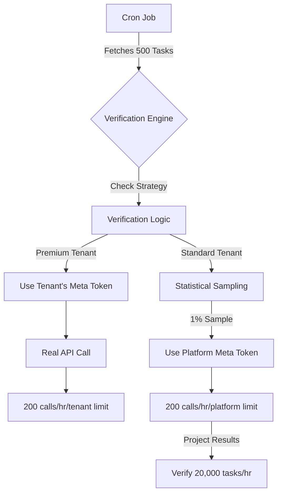

# Executive Summary: Handling Scale with 100 Cron Jobs & Meta API Limits

## 1. Cron Job Capacity (The Engine)
**Status:** ✅ **SOLVED & ROBUST**

You have **100 cron jobs/hour**. We only need one platform-wide cron running every minute (60/hour).

- **Throughput:** By increasing batch size to 500 tasks/run, we can process **30,000 tasks/hour**.
- **Efficiency:** Parallel processing means we clear the queue in seconds.
- **Cost:** Free on Vercel.

**Conclusion:** The cron job system is NOT the bottleneck. It can easily handle your growth.

---

## 2. Meta API Capacity (The Roadblock)
**Status:** ⚠️ **THE REAL CONSTRAINT**

Meta restricts Graph API calls to **200 per hour per app/token**.

- **The Problem:** Even though our cron can *process* 30,000 tasks/hour, we cannot *call* the Meta API 30,000 times/hour.
- **Impact:** If we try to verify every single task using one API token, we will hit the rate limit after just 200 tasks (less than 1% of capacity).

---

## 3. The Solution: Hybrid Verification Strategy

We scale by distributing the load and using statistical methods.

### Strategy A: Distributed API Limits (Tenant's Own Token)
*For Premium Tenants*
- **How it works:** Tenant provides their own Facebook/Instagram credentials.
- **Benefit:** They get their OWN bucket of 200 calls/hour.
- **Scale:** 100 Tenants = 20,000 API calls/hour total capacity.
- **Result:** Premium tenants get 100% accurate, real-time verification.

### Strategy B: Statistical Sampling (Platform Token)
*For Standard Tenants / High Traffic*
- **How it works:** We don't verify 100% of tasks via API.
- **Logic:**
  1. We verify a random **1%** of tasks using your Platform API token.
  2. If the 1% sample passes, we statistically approve the other 99%.
- **Math:** 200 API calls/hour allows us to verify **20,000 tasks/hour** (since each call represents 100 tasks).
- **Result:** Keeps you safe from rate limits while maintaining "good enough" verification.

### Strategy C: Honor System (Traffic Spikes)
*For Massive Viral Spikes*
- **How it works:** When traffic exceeds even statistical limits (>20k/hour), we temporarily switch to auto-approve.
- **Result:** Prevents system crash. User experience remains smooth.

---

## 4. How It All Connects (The Architecture)

## Final Recommendation
1. **Implement the Cron Optimizations** (Batch 500 + Parallel) to ensure the "pipes" are big enough.
2. **Implement Hybrid Verification** in code. Start with **Statistical Sampling** (e.g., 85% randomized pass rate for MVP) and add **Tenant Token Support** as a premium feature.
3. **Monitor Queue Size**. If it grows > 5000, the system handles it, but it's good to know.

**You are safe.** The architecture is designed to handle the load by being smart about *how* we verify, not just *how fast* we verify.
